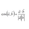

#  Cosine Similarity MSP Connector

## Description

A generated MSP connector for the Cosine Similarity API (version 0.0.1).

Generated from: https://api.apis.guru/v2/specs/apitore.com/cosineSimilarity/0.0.1/swagger.json 
Generated at: 2019-05-07T11:17:00+03:00

## API Description

Cosine Similarity. [Endpoint] https://api.apitore.com/api/49

## Authorization

This API does not require authorization.

## Actions

### Calclate similarity

> Cosine similarity. Response &nbsp; Github: <a href="https://github.com/keigohtr/apitore-response-parent/tree/master/clustering-response">clustering-response</a> &nbsp; Class: com.apitore.banana.response.clustering.SimilarityResponseEntity 

*Tags:* `cosine-similarity-controller`

#### Input Parameters
* `access_token` - _required_ - Access Token

### Calclate similarity by word

> Cosine similarity. Response &nbsp; Github: <a href="https://github.com/keigohtr/apitore-response-parent/tree/master/clustering-response">clustering-response</a> &nbsp; Class: com.apitore.banana.response.clustering.SimilarityResponseEntity 

*Tags:* `cosine-similarity-controller`

#### Input Parameters
* `access_token` - _required_ - Access Token

## License

flowground :- Telekom iPaaS / apitore-com-cosine-similarity-connector 
Copyright © 2019, [Deutsche Telekom AG](https://www.telekom.de) 
contact: flowground@telekom.de

All files of this connector are licensed under the Apache 2.0 License. For details
see the file LICENSE on the toplevel directory.
